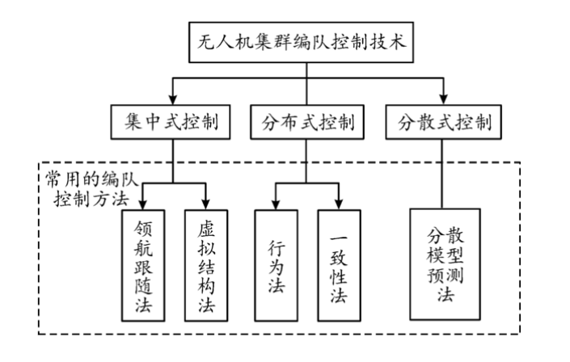

# Drone_swarm
2025年暑假自学习无人机编队控制代码

本项目仅供自己学习作为参考，使用Github平台记录学习
2025/7/2：学习内容 无人机集群系列——无人机集群编队算法
网址（https://blog.csdn.net/dally2/article/details/）

根据《无人机集群协同控制技术综述》协同编队控制结构：集中式、分布式、分散式

主流编队控制方法：
（1）领航跟随法（Leader-Follower）
原理‌：指定一架无人机为领航者，其余跟随者基于领航者状态调整自身位置。
‌优点‌：逻辑简单，计算量低，适合线性编队。
‌缺点‌：过度依赖领航者，难以处理复杂队形变换。
无人机编队控制Python代码实现（领航-跟随法）
领航-跟随法通过指定领航者与跟随者的相对位置偏移量实现编队控制。
